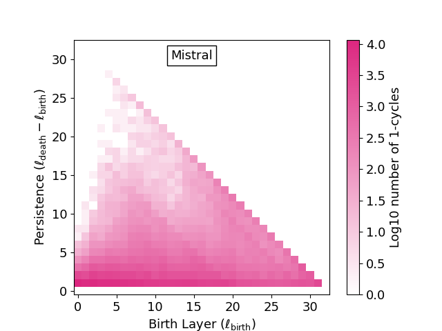
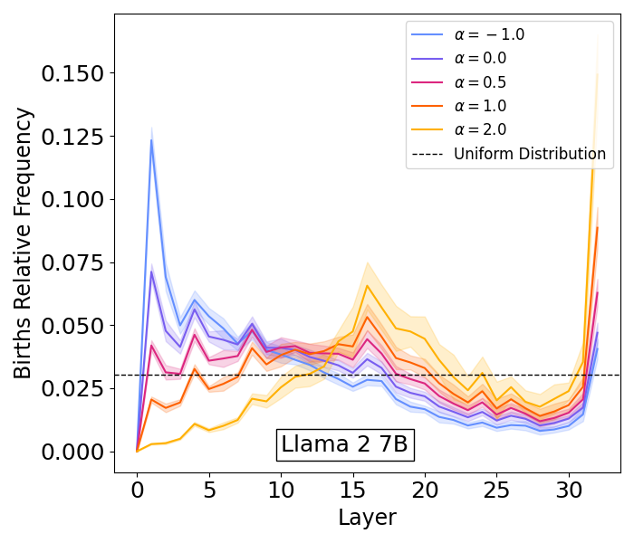
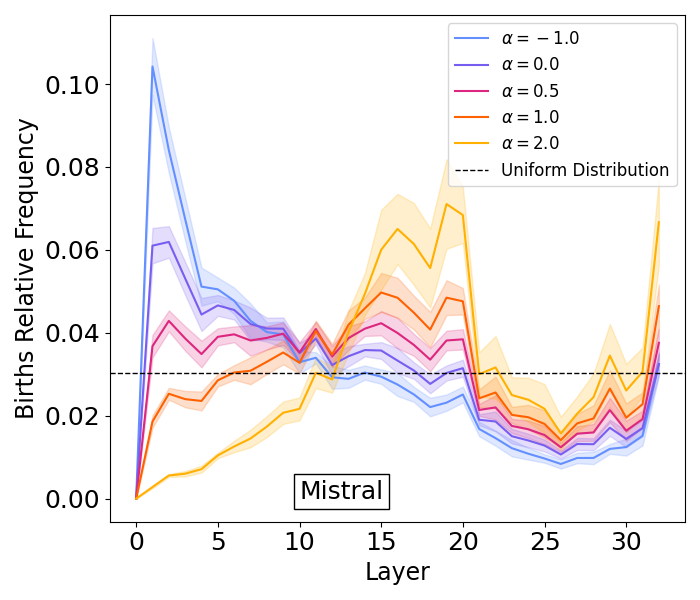
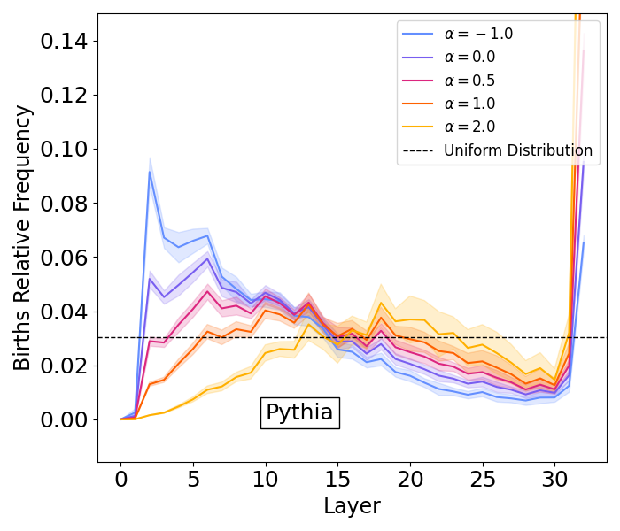
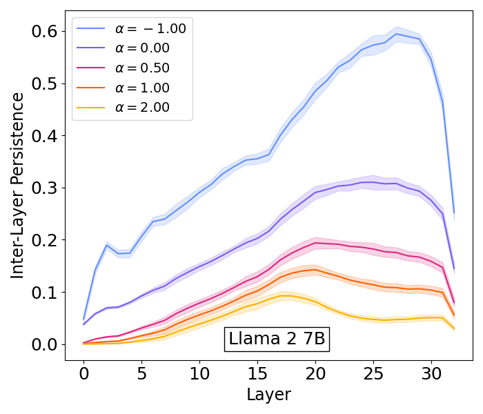
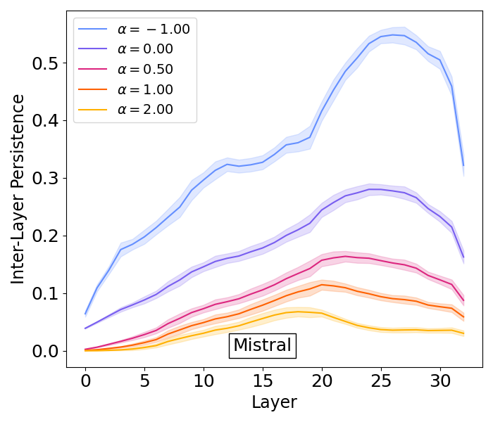
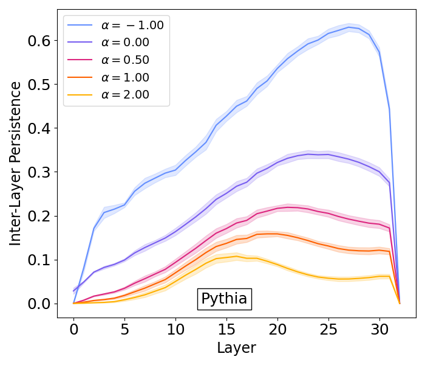

# Rebuttal Plots
New benchmarks at the end.
## Persistence 

Persistence computed on the SST Dataset with 16 splits as in Fig. 3 for the models Llama 2 7B, Mistral and Pythia

## Birth Relative Frequency

Birth Relative Frequency computed on the SST Dataset with 16 splits as in Fig. 3 for the models Llama 2 7B, Mistral and Pythia

## Inter Layer Persistance

Inter Layer Persistance computed on the SST Dataset with 16 splits as in Fig. 3 for the models Llama 2 7B, Mistral, Pythia

# Benchmarks

| Model     | CMMLU |               |                 | Commonsense-QA |           |             | WSC   |           |             |
|-----------|-------|---------------|-----------------|----------------|-----------|-------------|-------|-----------|-------------|
|           | full  | this work     | other works     | full           | this work | other works | full  | this work | other works |
| Llama 2   | 32.17 | 28.51         | **30.00**       | 55.94          | 38.40     | **52.83**   | 88.63 | **84.60** | 75.80       |
| Llama 3   | 50.96 | 34.02         | 34.02           | 73.45          | 65.93     | 65.93       | 85.70 | 80.94     | 80.94       |
| Mistral 7b| 44.47 | **38.84**     | 29.68           | 69.78          | **62.33** | 30.62       | 87.18 | 69.60     | **72.15**   |
| Pythia    | -     | -             | -               | -              | -         | -           | 81.67 | 60.06     | **71.43**   |

New benchmarks done on Llama 2 7B, Llama 3 8B, Mistral and Pythia, look at Table 2 in Appendix F to see the layer pruned by the different methods.
Note that there are no results of Pythia for CMMLU and Commonsense-QA because 
the model performs like random choice due to the formatting of the benchmark. 
This is present also in the main paper for MMLU and it is highlighted in the footnote 10.